# Issue Agent 开发流程图

本文档描述当前单机 orchestrator 从 GitHub Issue 领取到 Pull Request 等待人工审核的完整流程。
实现细节和运维说明仍以 [README](../README.md) 为准。

## 主流程

```mermaid
flowchart TD
    Start[once / serve 启动] --> Preflight{必需 labels 都存在?<br/>dry_run 时跳过}
    Preflight -->|否| PreflightFail[打印 gh label create 指引<br/>退出码 1，不启动 worker]
    Preflight -->|是| Recover[恢复被中断的 SQLite 状态]
    Recover --> Poll[拉取 agent-ready、agent-running<br/>以及可选的无 agent-* Issue]

    Poll --> Mismatch{正文声明的 blocker<br/>与原生 blockedBy 一致}
    Mismatch -->|不一致| MismatchNotice[记录 dependency_body_mismatch<br/>评论提示「以原生关系为准」]
    MismatchNotice --> DepGate
    Mismatch -->|一致或正文未声明| DepGate{依赖门禁：原生 blockedBy<br/>是否全部 closed}
    DepGate -->|否，或自依赖| DepBlocked[记录 dependency_blocked<br/>blocker 集合变化时评论一次<br/>本轮跳过，不领取]
    DepBlocked --> Poll
    DepGate -->|是| DepCleared{上一轮通知过 blocker}
    DepCleared -->|是| ClearedNotice[记录 dependency_cleared<br/>评论「依赖已关闭」]
    ClearedNotice --> Kind
    DepCleared -->|否| Kind{Issue 类型}

    Kind -->|无 agent-* 标签| PlanClaim[幂等领取 Plan-only]
    PlanClaim --> PlanWorkspace[创建或复用 worktree<br/>重置到 origin/base]
    PlanWorkspace --> Planner[只读 Planner 生成输出]
    Planner --> PlanGuard{工作区被修改?}
    PlanGuard -->|是| PlanRestore[恢复 HEAD 并记录失败]
    PlanGuard -->|否| PlanShape{Planner 输出形态}

    PlanShape -->|questions| Clarify[评论问题、添加 agent-needs-info<br/>状态回 pending，不消耗失败预算]
    Clarify --> HumanAnswer[人工在评论中回答]
    HumanAnswer --> ClarifyRelease[后续轮询检测到回答<br/>移除 agent-needs-info]
    ClarifyRelease --> Poll
    Clarify -.->|追问轮数超上限| ClarifyPark[记录 clarify_exhausted<br/>保留标签，等待人工 reset]
    ClarifyPark --> Reset

    PlanShape -->|split| SplitRecord[拆分决策先落盘 SQLite<br/>记录 split_proposed]
    SplitRecord --> SplitCreate[逐个子 Issue 创建<br/>继承非 agent-* 标签<br/>不加 agent-ready]
    SplitCreate -->|创建或链接失败| SplitPartial[记录 split_partial<br/>失败评论列出已建子 Issue<br/>父 Issue 留在重试路径]
    SplitPartial --> Failed
    SplitCreate --> SplitLink[建立 parent 与兄弟 blockedBy 链接<br/>已 linked 的子 Issue 重试时跳过]
    SplitLink --> SplitPark[记录 split_created<br/>父 Issue 置 split 并加 human-review]
    SplitPark --> Reset

    PlanShape -->|tasks| SavePlan[Plan 写入 SQLite 和 .agent/plan.md]
    SavePlan --> AutoReady{auto_ready_with_plan 开启<br/>正文自带完整计划<br/>且不是拆分出的子 Issue}
    AutoReady -->|是| AutoRelease[记录 auto_ready_applied<br/>评论 Plan 并直接添加 agent-ready]
    AutoRelease --> Claim
    AutoReady -->|否| PlanComment[评论 Plan，添加 agent-planned<br/>等待人工审核]
    PlanComment --> WaitReady[人工添加 agent-ready]

    Kind -->|agent-ready / agent-running| Claim[按 agent 标签路由并幂等领取]
    WaitReady --> Claim
    Claim --> Workspace[创建或复用 Issue worktree]
    Workspace --> PersistPlanning[持久化 planning 状态]
    PersistPlanning --> RunningLabel[添加 agent-running<br/>移除 agent-ready]
    RunningLabel --> PlanSource{已有持久化 Plan?}
    PlanSource -->|否| GeneratePlan[生成并持久化 Plan]
    PlanSource -->|是| Resume[定位第一个未完成任务]
    GeneratePlan --> Resume
    Resume --> Anchor[硬重置到上一个完成任务的 commit<br/>或 origin/base]
    Anchor --> Baseline[逐命令采集 checks 基线]
    Baseline --> TaskLoop[进入顺序任务循环]

    TaskLoop --> Coding[写 .agent/task.md<br/>状态 coding，执行实现 Agent]
    Coding --> Checks[orchestrator 独立执行 checks]
    Checks -->|新增失败| TaskRetry{任务内还有尝试?}
    TaskRetry -->|是| Coding
    TaskRetry -->|否| Failed
    Checks -->|通过或仅预存失败| Changed{存在代码改动?}
    Changed -->|否| TaskRetry
    Changed -->|是| Commit[首次 commit；返修时 amend]
    Commit --> ReviewMode{review.task_mode}
    ReviewMode -->|off| TaskDone[任务标记 done 并记录 commit]
    ReviewMode -->|formal 默认| FormalReview[确定性形式审查<br/>secrets / 禁改文件 / 空 diff]
    ReviewMode -->|full| FullGate{配置 Reviewer?}
    FullGate -->|否| TaskDone
    FullGate -->|是| TaskReview[只读 LLM Review 最近一个 commit]
    FormalReview --> FormalGuard{形式审查通过?}
    FormalGuard -->|否，首次| Coding
    FormalGuard -->|否，第二次| ManualReview[停止自动返修，等待人工处理]
    FormalGuard -->|是| TaskDone
    TaskReview --> ReviewGuard{Review 结果}
    ReviewGuard -->|工作区被修改| RestoreReview[恢复到 Review 前 HEAD]
    RestoreReview --> Failed
    ReviewGuard -->|无合法 verdict| Failed
    ReviewGuard -->|REQUEST_CHANGES，首次| Coding
    ReviewGuard -->|REQUEST_CHANGES，第二次| ManualReview
    ReviewGuard -->|APPROVE| TaskDone
    TaskDone --> MoreTasks{还有未完成任务?}
    MoreTasks -->|是| TaskLoop
    MoreTasks -->|否| FinalReuse{已有同 commit 的终审通过记录?}
    FinalReuse -->|是| PushState
    FinalReuse -->|否| FinalReviewer{配置 Reviewer?}
    FinalReviewer -->|是| FinalReview[整分支只读 Review]
    FinalReviewer -->|否| FinalChecks

    FinalReview --> FinalResult{最终 Review 结果}
    FinalResult -->|REQUEST_CHANGES，首次| FinalFix[实现 Agent 修复、checks、独立 commit]
    FinalFix --> FinalReview
    FinalResult -->|REQUEST_CHANGES，第二次| ManualReview
    FinalResult -->|无合法 verdict / 只读违规| Failed
    FinalResult -->|APPROVE| FinalChecks[完整执行最终 checks]
    FinalChecks -->|失败| FinalFix
    FinalChecks -->|通过| PushState[持久化 pushing 状态]
    PushState --> Push[push 分支并创建 PR]
    Push --> HumanState[持久化 human_review]
    HumanState --> HumanLabel[添加 human-review、评论 PR 地址]

    PlanRestore --> PlanFailureBudget{失败预算耗尽?}
    Failed --> FailureBudget{失败预算耗尽?}
    FailureBudget -->|否| Requeue[添加 agent-failed 和 agent-ready]
    FailureBudget -->|是| Park[添加 agent-failed，等待 reset]
    PlanFailureBudget -->|否| Poll
    PlanFailureBudget -->|是| PlanPark[保持无 agent-* 标签<br/>拒绝再次领取，等待 reset]
    ManualReview --> Park
    Requeue --> Poll
    Park --> Reset[人工 issue-agent reset]
    PlanPark --> Reset
    Reset --> Poll
```

## 依赖、自动就绪、澄清与拆分

四条支路都发生在「领取」和「规划」两处，不改变后续的编码—审查—push 主线。

- **依赖门禁**只认 GitHub 原生 `blockedBy`，判定时机是首次领取之前；已经带 `agent-running`（或
  SQLite 里已是运行态）的 Issue 直接豁免，这样崩溃恢复不会被中途重开的 blocker 卡死。blocker 集合
  变化时才评论一次，通知去重记录同样落在 SQLite，因此每轮轮询对 `gh` 的读取只有 blocker 状态一项，
  且同一轮内多个候选共享同一个 blocker 只查一次。未取到状态的 blocker 按「未关闭」处理——多等一轮
  是安全方向。正文里手写的 `Depends on #12` 只用于比对，不一致时评论提醒，不参与放行。
- **自动就绪**只在正文自带完整计划、且该 Issue 不是本 orchestrator 拆分出来的子 Issue 时触发；它还
  要求配置了 `planner_agent`，否则 Planner 对任何 Issue 都会回「正文即计划」，等于取消人工审核。
- **澄清回环**由 Planner 显式返回 `{"questions": [...]}` 触发，不靠启发式判断描述是否简略。追问轮数
  有上限，用尽后 `agent-needs-info` 保留、评论改为指示人工 `reset`。回答检测按「非自己、且时间戳
  晚于本轮标记」的评论判定；检测不到自己的登录名时整条链路退化为人工移除标签，不会自问自答。
- **拆分**的决策先落盘再创建，中途崩溃或部分失败都从 SQLite 里的记录续跑：已创建的子 Issue 按记录
  里的编号跳过，链接按 `linked` 标记跳过。子 Issue 继承父 Issue 的非 `agent-*` 标签，但**不**加
  `agent-ready`，需要人工判断后放行。父 Issue 停在 `split` + `human-review`，既不自动关闭也不自动
  重规划，只有人工 `reset` 才会清掉拆分记录并按单 Issue 重新规划。

## 持久化顺序原则

- 领取、规划、编码、测试、Review、push 和人审状态均先写入 SQLite，再执行对应的 GitHub Label
  变化；进程重启后依靠 SQLite 与残留的 `agent-running` 标签恢复。崩溃中断会计入该 Issue 的
  失败预算（每次恢复 `failures` +1），预算耗尽即搁置等待 `reset`，防止可复现崩溃的 Issue
  无限重试。
- 每个完成的 Plan 任务保存 commit hash。失败重试先回到最近完成任务的 commit，并将该任务最后一次
  错误重新提供给实现 Agent。
- 终审通过后持久化已批准的 commit；push/PR 失败的重试在同一 commit 上复用该结果（跳过重审与
  完整 checks），commit 变化则重新终审。
- push 和 PR 创建只由 orchestrator 执行；编码 Agent、Planner 与 Reviewer 的 prompt 均禁止执行
  GitHub、merge、部署、迁移、secrets 等外部操作。

## 只读与检查边界

- Planner 开始前工作区会回到 `origin/<base_branch>`；Planner 或 Reviewer 如果产生 tracked 或
  non-ignored untracked 改动，orchestrator 会恢复到安全 commit 并将本轮标记失败。
- 只读守护不覆盖 gitignored 文件：`.venv`、构建缓存、被 ignore 的 `.env` 等 ignored 状态的改动
  不会触发恢复。主防线是 Planner/Review 命令自身的只读模式（如 `--permission-mode plan`、
  只读 sandbox），git status 守护只是兜底。
- 任务级审查按 `review.task_mode` 分档：`formal`（默认）为确定性检查（diff 中 secrets 模式、
  禁改文件、空 commit），零 LLM 调用且不依赖 Reviewer 配置；`full` 为 LLM 只读深度 Review；
  `off` 跳过。git 基础设施故障（如 worktree 损坏）以可重试错误处理，参与任务内返修循环。
- checks 基线按命令隔离。pytest 使用失败 node ID 判断新增回归；其他命令仅在退出码和合并后的输出均与
  基线一致时容忍。
- 明确的第二次不通过（LLM `REQUEST_CHANGES` 或形式审查拒绝）停止自动返修；无合法 verdict 和只读
  违规属于普通失败，在 Issue 失败预算内重新排队。
- 每次 Agent CLI 调用的耗时与 token 用量（CLI 输出支持的结构化格式时）双写：`agent_call` 事件进
  JSONL 执行日志，按 Issue/task 累积总量进 SQLite；Codex JSONL 和 Claude JSON envelope 均可解析，
  失败/超时调用也保留耗时。`report` 分别显示 wall/agent/check time 与 token/cost。
- 相同 anchor/checks 的并发 baseline 使用 single-flight 和有界 LRU；`checks.task_commands` 可将中间
  task 限制为快速检查，最终 gate 始终执行完整 `checks.commands`。
- 拆分子 Issue 的标题与正文由 Planner 生成，写入 GitHub 前同样过 `redact_secrets`，与本仓库其他
  出站文本一致；子 Issue 只继承父 Issue 的非 `agent-*` 标签，不会继承 `agent-running` 之类的运行态。
