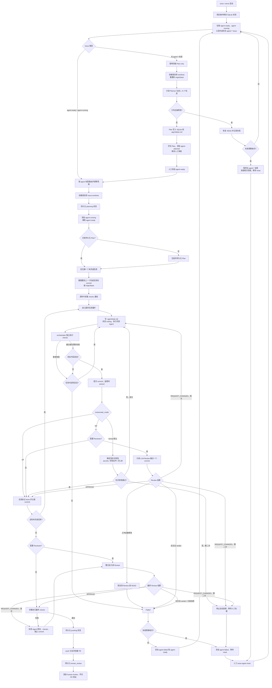

# Issue Agent 开发流程图

本文档描述当前单机 orchestrator 从 GitHub Issue 领取到 Pull Request 等待人工审核的完整流程。
实现细节和运维说明仍以 [README](../README.md) 为准。

## 主流程

## 持久化顺序原则

- 领取、规划、编码、测试、Review、push 和人审状态均先写入 SQLite，再执行对应的 GitHub Label
  变化；进程重启后依靠 SQLite 与残留的 `agent-running` 标签恢复。
- 每个完成的 Plan 任务保存 commit hash。失败重试先回到最近完成任务的 commit，并将该任务最后一次
  错误重新提供给实现 Agent。
- push 和 PR 创建只由 orchestrator 执行；编码 Agent、Planner 与 Reviewer 的 prompt 均禁止执行
  GitHub、merge、部署、迁移、secrets 等外部操作。

## 只读与检查边界

- Planner 开始前工作区会回到 `origin/<base_branch>`；Planner 或 Reviewer 如果产生 tracked 或
  non-ignored untracked 改动，orchestrator 会恢复到安全 commit 并将本轮标记失败。
- 任务级审查按 `review.task_mode` 分档：`formal`（默认）为确定性检查（diff 中 secrets 模式、
  禁改文件、空 commit），零 LLM 调用且不依赖 Reviewer 配置；`full` 为 LLM 只读深度 Review；
  `off` 跳过。git 基础设施故障（如 worktree 损坏）以可重试错误处理，参与任务内返修循环。
- checks 基线按命令隔离。pytest 使用失败 node ID 判断新增回归；其他命令仅在退出码和合并后的输出均与
  基线一致时容忍。
- 明确的第二次不通过（LLM `REQUEST_CHANGES` 或形式审查拒绝）停止自动返修；无合法 verdict 和只读
  违规属于普通失败，在 Issue 失败预算内重新排队。
- 每次 Agent CLI 调用的耗时与 token 用量（CLI 输出支持的结构化格式时）双写：`agent_call` 事件进
  JSONL 执行日志，按 Issue/task 累积总量进 SQLite；Codex JSONL 和 Claude JSON envelope 均可解析，
  失败/超时调用也保留耗时。`report` 分别显示 wall/agent/check time 与 token/cost。
- 相同 anchor/checks 的并发 baseline 使用 single-flight 和有界 LRU；`checks.task_commands` 可将中间
  task 限制为快速检查，最终 gate 始终执行完整 `checks.commands`。
